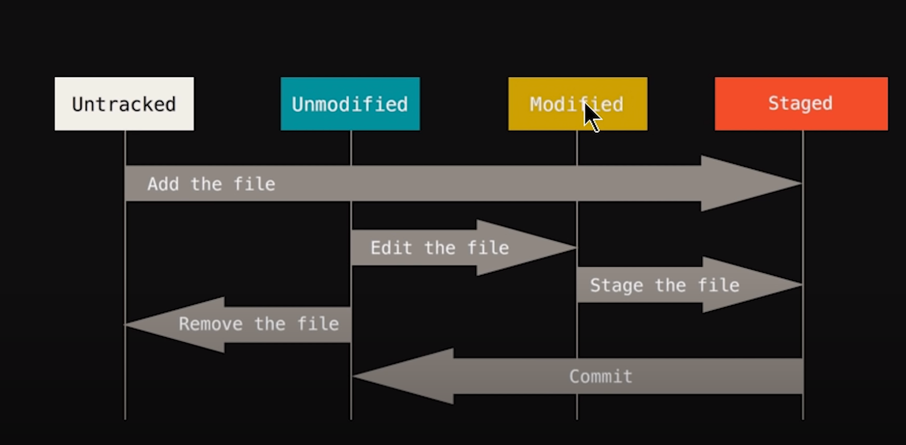

Github

1) git init<directory>: Create empty Git repo in specified directory. Run with no arguments to initialize the current directory as a git repository.
2) ls -lart: show all files and folder
3) git status: List which files are staged, unstaged, and untracked.

4) git add <directory>: Stage all changes in <directory> for the next commit. Replace <directory> with a <file> to change a specific file.
5) initial commit: will take to windows where i for insert comment -> Esc ":wq" to exit.

6) git add -A : Stage all files
7) git commit -m "commit message"

8) git checkout <filename>: back to staging no change will apply.

9) git checkout -f : back to staging no change will apply to all changed files.
10) git status:  List which files are staged, unstaged, and untracked.

11) git log: Display the entire commit history using the default format. For customization see additional options.
12) git log -p -<int>: number of change logs.

13) git diff: Show unstaged changes between your index and working directory. (compare working dir to staging area)
14) git diff --staged: compare staging area to last commit.

15) git commit -a -m "Skipped staging area": skip staging area and commit directly.

16) git rm <filename>: remove file from staginging area and directory.
17) git rm --cached <filename>: only remove file from staging area (it will be untracked file)
 
18) git status -s : M- modified , green M show staging area, red M shows working area.
  
19) git ignore:
  a) create file : touch .gitignore
  b) write file names
  c) /filename - only ignore filename in dir 
     *filename - ignore file trailing filename
     Foldername/ - add folder and all files to ignore

Branches- making seperate copy of your project
 
20) git branch: List all of the branches in your repo. Add a <branch> argument to create a new branch with the name <branch>.
21) git checkout -b <branch> : Create and check out a new branch named <branch>. Drop the -b flag to checkout an existing branch.
22) git merge <branch>: Merge <branch> into the current branch.

UNDOING CHANGES
 
23) git revert <commit>: Create new commit that undoes all of the changes made in <commit>, then apply it to the current branch. 
24) git reset <file> Remove <file> from the staging area, but leave the working directory unchanged. This unstages a file without overwriting any changes.
25) git clean -n :  Shows which files would be removed from working directory. Use the -f flag in place of the -n flag to execute the clean.

REWRITING GIT HISTORY
 
26) git commit --amend: Replace the last commit with the staged changes and last commit combined. Use with nothing staged to edit the last commit’s message.
27) git rebase <base>: Rebase the current branch onto <base>. <base> can be a commit ID, branch name, a tag, or a relative reference to HEAD.
28) git reflog: Show a log of changes to the local repository’s HEAD. Add --relative-date flag to show date info or --all to show all refs.
29) git rebase -i <base> : Interactively rebase current branch onto <base>. Launches editor to enter commands for how each commit will be transferred to the new base
30) git pull --rebase <remote> : Fetch the remote’s copy of current branch and rebases it into the local copy. Uses git rebase instead of merge to integrate the branches.
 

